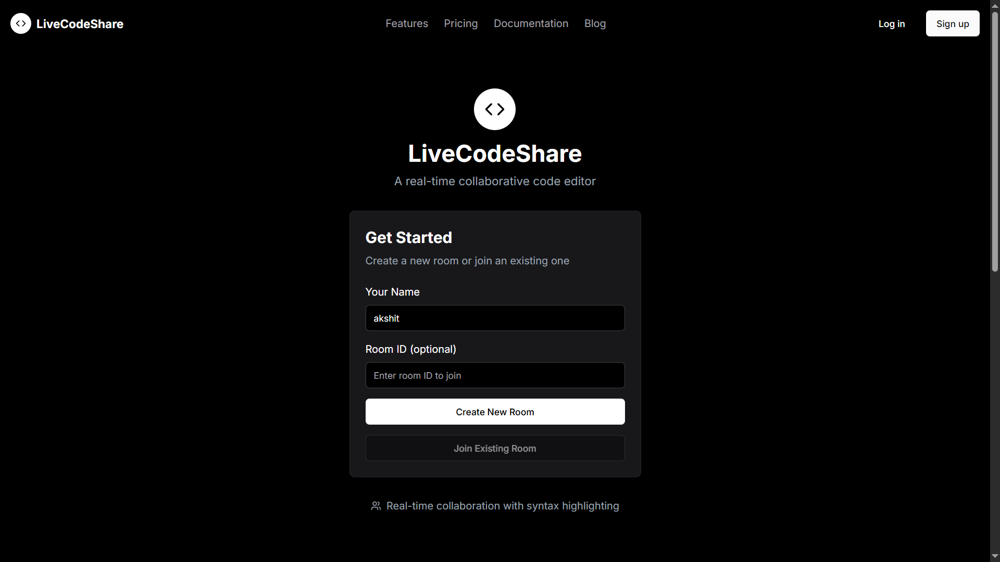

## 👨‍💻 About the Author

**Developed and Maintained by Akshit dhiman**

- 💼 **Portfolio**: https://akshitd.vercel.app
- 💻 **LinkedIn**: [https://www.linkedin.com/in/akshit-dhiman](https://www.linkedin.com/in/akshithdh/)
- 📧 **Email**: [akshithdh@gmail.com](mailto:akshithdh@gmail.com)
---

# LiveCodeShare


## 🧪 Overview

**LiveCodeShare** is a real-time collaborative code editor built with a focus on **multi-user synchronization**, **live code previews**, and **team collaboration**. It is designed to simulate professional pair programming, live interviews, and remote team coding sessions. This platform is production-ready and validated through **functional testing**, **load testing**, and **security validations**.

---

## ✅ Key Features

- **Real-Time Multi-User Code Editing**
- **Instant Preview Rendering for HTML, CSS, JavaScript**
- **Room-Based Collaboration with User Presence Tracking**
- **Integrated Team Messaging**
- **JWT-Based Secure Authentication**
- **Production Deployment on Vercel with Health Monitoring**

---

## 🛠️ Technologies and Testing Scope

- **Technology Stack:**  
  - Frontend: Next.js, Monaco Editor, TailwindCSS  
  - Backend: Node.js, Express.js, Socket.io, MongoDB  
  - Authentication: JWT, NextAuth.js

- **Testing Focus Areas:**  
  - Real-time event validation under load  
  - Multi-user synchronization  
  - Network recovery and reconnection handling  
  - Access control and data isolation  
  - Production deployment validation

- **Deployment Tools:**  
  - Vercel (Production)  
  - Docker (Local Testing)  
  - Health Monitoring and Error Logging

---

## 🧪 Testing Methodology Overview

1. **Functional Testing:**  
   Verified all key user flows including **code editing**, **live previews**, and **messaging**.

2. **Load Testing:**  
   Simulated **high-concurrency scenarios** with **15+ users**, validating **real-time stability**.

3. **Security Testing:**  
   Validated **role-based access control**, **JWT session management**, and **data isolation** across rooms.

4. **Failure Simulation Testing:**  
   Tested **message consistency** and **system recovery** during **network drops** and **forced disconnections**.

5. **Deployment Validation:**  
   Verified **production builds** on **Vercel** with **monitoring enabled** to ensure **stable user experience**.

---

## ⚙️ Step-by-Step Setup and Execution Guide

### 1. Prerequisites
Before getting started, ensure the following tools are installed on your system:

- Node.js v16 or higher
- NPM or Yarn package manager
- MongoDB Atlas Account (for production) or MongoDB local instance (for testing)
- Git (optional for cloning the repository)

---

### 2. Cloning the Repository

Open your terminal and run:

```bash
git clone https://github.com/your-org/livecodeshare.git
cd livecodeshare
```

### 3. Installing Dependencies

Install all required Node.js packages by running:

```bash
npm install
```

Or, if you prefer Yarn:

```bash
yarn install
```

### 4. Configuring Environment Variables

Create a `.env.local` file in the root of the project. Use the following template to configure the environment:

```
MONGODB_URI=your-mongodb-connection-string
NEXTAUTH_SECRET=your-random-secret
NEXTAUTH_URL=http://localhost:3000
```

Descriptions:
- MONGODB_URI: MongoDB connection string (from MongoDB Atlas or local instance).
- NEXTAUTH_SECRET: A random secret string for session management.
- NEXTAUTH_URL: Local development URL.

Make sure these values are valid and correctly set.

### 5. Running the Application Locally

Start the development server with:

```bash
npm run dev
```

The application will start on: [http://localhost:3000](http://localhost:3000)

Open this URL in your web browser.

### 6. Testing the Application Locally

Open multiple browser windows or tabs to simulate multiple users.

Create or join a room and verify:
- Real-time collaborative editing.
- Instant preview rendering.
- Team chat messaging.
- User presence tracking.

### 7. Dockerized Local Environment (Optional)

If you prefer running in Docker:

Ensure Docker is installed.

Build and run the container:

```bash
docker build -t livecodeshare .
docker run -p 3000:3000 --env-file .env.local livecodeshare
```

Visit: [http://localhost:3000](http://localhost:3000)

---

## 📫 Contact  
Feel free to reach out for collaborations or questions!

**Akshit Dhiman**
